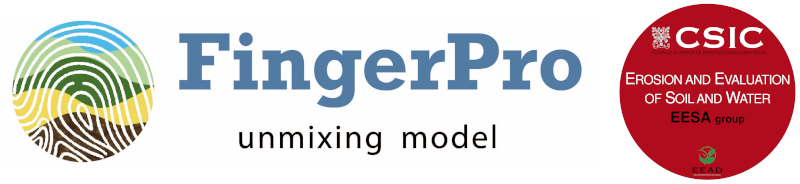

[](https://cran.r-project.org/package=fingerPro)
[](https://github.com/metacran/cranlogs.app)
[](https://www.repostatus.org/#active)



This is the official repository of `fingerPro`. It contains the source code, current updates, and documentation validated by the core development team for sediment fingerprinting research.

`fingerPro` is an R framework for sediment source fingerprinting. It combines data exploration, tracer selection, source unmixing, visualization, and validation of source apportionments. The package builds on more than 16 years of methodological work by the EESA research group (Erosion and Evaluation of Soil and Water) at the Spanish National Research Council (CSIC), Experimental Station of Aula Dei (EEAD), Zaragoza, Spain.

## Core development team

- **B. Latorre:** Core Developer
- **L. Gaspar:** Core Developer
- **A. Navas:** Core Developer, Principal Investigator, Funding Acquisition, Project Coordination, and Thesis Director

Funding projects: CICYT MEDEROCAR (CGL2008-0831), PTA contract (PTA2009-2258-P), CICYT EROMED (CG2011-25486), CICYT TRAZESCAR (CGL2014-52986-R), Predoctoral contract (BES-2015-071780), AEI RedNutSoil (PID2019-104857RB-I00), and AEI PID2019-103946RJ-I00.

## Contributors during PhD thesis development

- **L. Palazón:** Contributor during her PhD thesis (2010-2016), funded by MEDEROCAR, PTA2009-2258-P, EROMED, and TRAZESCAR.
- **I. Lizaga:** Contributor during his PhD thesis (2016-2020), funded by TRAZESCAR and the BES-2015-071780 predoctoral contract.

---

## Methodological principles

Each mixture should be analysed independently. Optimum tracer selection depends on the combined information from the sources and the mixture, so a tracer set selected for one mixture is not automatically suitable for another. Using different optimum tracer sets does not prevent comparison between mixtures; it allows the analysis to adapt to each dataset.

The user has an active role in tracer selection. Intermediate results should be interpreted before choosing a seed, setting an error threshold, or proceeding to unmixing.

## Key features

### Data input and exploration

- `read_database()` reads a CSV file and validates its structure before analysis.
- `box_plot()` displays tracer distributions and variability.
- `correlation_plot()` examines relationships among tracers within sources.
- `LDA_plot()` and `PCA_plot()` display source discrimination in reduced dimensions.
- `ternary_diagram()` visualizes individual tracer behaviour, particularly for three-source problems.
- `range_test()` identifies mixture tracer values outside the range defined by the sources.

### Consistent Tracer Selection

CTS is the tracer-selection method proposed by `fingerPro`. CI and CR are complementary screening methods for identifying non-conservative or dissenting tracers, and this screening purpose is already integrated into the CTS workflow. CI or CR should therefore not be used alone to define the final tracer set: neither method evaluates tracer discrimination or the mathematical consistency of the selected combination, whereas CTS addresses both properties.

The CTS workflow in `fingerPro` 2.1 has two steps:

1. `CTS_explore()` evaluates all possible minimal tracer combinations. It reports physical feasibility and dispersion, which help the user select a candidate seed.
2. `CTS_select()` extends the selected seed and retains tracers whose normalized error is below a user-defined threshold.

This two-step interface replaces the former `CTS_seeds()` and `CTS_error()` workflow.

### Source unmixing and results

- `unmix()` estimates source contributions using constrained or unconstrained mass-balance models. It supports Monte Carlo uncertainty analysis and linear variability propagation (LVP).
- `plot_results()` displays the distributions of estimated source contributions as density or violin plots.
- `validate_results()` compares observed mixture tracer values with values predicted from a proposed apportionment. The normalized errors help identify mathematically inconsistent solutions.

### Isotopic tracer analysis

`CB_method()` applies the Conservative Balance transformation to isotopic ratio and content data. The resulting virtual scalar tracers can be analysed with the standard unmixing workflow and combined with geochemical tracers when appropriate.

Additional functions, including `CR()`, `CI()`, `DFA_test()`, `KW_test()`, and `individual_tracer_analysis()`, remain available for complementary analyses. See the function documentation for their intended use.

---

## Installation

Install the stable release from CRAN:

```r
install.packages("fingerPro")
library(fingerPro)
```

## Quick start

The package includes raw and averaged examples for geochemical and isotopic tracers. This example follows the main workflow for a three-source geochemical dataset:

```r
library(fingerPro)

# Read and validate the example data
data <- read_database(
  system.file(
    "extdata",
    "example_geochemical_3s_raw.csv",
    package = "fingerPro"
  )
)

# Explore the data
box_plot(data)
correlation_plot(data)
LDA_plot(data)
PCA_plot(data)
ternary_diagram(data)
range_test(data)

# Explore minimal tracer combinations
tracer_seeds <- CTS_explore(data, iter = 1000)

# Select a seed after inspecting feasibility and dispersion
selected_data <- CTS_select(
  data,
  tracer_seeds,
  seed_id = 1,
  error_threshold = 0.05
)

# Estimate and display source contributions
output_unmix <- unmix(selected_data)
plot_results(output_unmix, violin = FALSE)

# Validate a proposed apportionment
normalized_error <- validate_results(
  selected_data,
  apportionments = c(0.435, 0.285, 0.280),
  error_threshold = 0.05
)
```

The selected `seed_id` should be based on the `CTS_explore()` results. Prefer combinations with a high percentage of physically feasible solutions and low dispersion across sources; do not assume that row 1 is appropriate for every dataset.

## Documentation

- [About FingerPro](vignettes/About-FingerPro.Rmd): methodological principles, package features, citation, and references.
- [Getting Started](vignettes/Getting-Started.Rmd): installation, project organization, supported input formats, and example datasets.
- [Workflow Example](vignettes/Workflow-Example.Rmd): a complete analysis from data validation to result validation.

Function-level documentation is available from R, for example:

```r
help("CTS_explore", package = "fingerPro")
help("CTS_select", package = "fingerPro")
help("unmix", package = "fingerPro")
help("validate_results", package = "fingerPro")
```

---

## Contributing and feedback

Questions, suggestions, and bug reports can be submitted through the [GitHub Issues](https://github.com/eead-csic-eesa/fingerPro/issues) page or sent to [fingerpro@eead.csic.es](mailto:fingerpro@eead.csic.es).

## Citing fingerPro

To cite the package, use:

> Latorre, B., Gaspar, L., Lizaga, I., Palazon, L., Vu, V. Q., and Navas, A. (2026). *FingerPro: Unmixing Model Framework* (R package). Comprehensive R Archive Network (CRAN). https://doi.org/10.32614/CRAN.package.fingerPro

The package also provides its citation metadata through:

```r
citation("fingerPro")
```

The [About FingerPro vignette](vignettes/About-FingerPro.Rmd) contains the legal deposits and the full list of methodological and applied references.

## License

`fingerPro` is distributed under the [GNU General Public License version 2](LICENSE).
